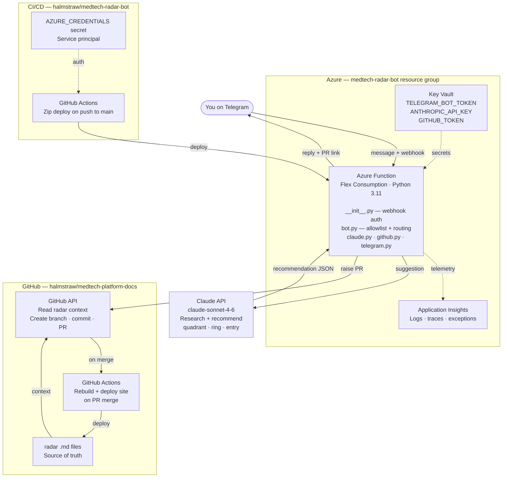

# medtech-radar-bot

AI-powered Telegram bot for updating the MedTech Platform technology radar.

## What it does

Send a technology suggestion via Telegram. The bot:
1. Researches the technology using web search
2. Recommends a quadrant and ring based on the platform context
3. Shows you the proposed radar entry
4. On confirmation, raises a GitHub PR against `halmstraw/medtech-platform-docs`

## Architecture



### Component responsibilities

| Component | Responsibility | Key config |
|---|---|---|
| Azure Function | Receives Telegram webhook, orchestrates the flow, sends replies | `function/radar_bot/` |
| `__init__.py` | HTTP entry point, validates webhook secret header | `TELEGRAM_WEBHOOK_SECRET` env var |
| `bot.py` | Allowlist check, message routing, conversation logic | `ALLOWED_USER_IDS` set |
| `claude.py` | Calls Claude API, parses JSON recommendation | `ANTHROPIC_API_KEY`, model `claude-sonnet-4-6` |
| `github.py` | Fetches radar context, creates branch, commits entry, opens PR | `GITHUB_TOKEN` (contents + PRs write) |
| `telegram.py` | Sends messages back to the user | `TELEGRAM_BOT_TOKEN` |
| Azure Key Vault | Stores all secrets — not in environment variables directly | Linked via Function App config |
| Application Insights | Logs, traces, exceptions — query via KQL | Auto-linked on Function App creation |
| GitHub Actions (bot repo) | Deploys on push to main via zip deploy | `AZURE_CREDENTIALS` secret |
| GitHub Actions (docs repo) | Rebuilds MkDocs + radar on PR merge to main | `AZURE_STATIC_WEB_APPS_API_TOKEN` |
| radar .md files | One file per technology, frontmatter-driven | `radar/data/radar/YYYY-MM-DD/` |

## Stack

| Component | Technology |
|---|---|
| Runtime | Azure Functions (Flex Consumption, Python 3.11) |
| Secrets | Azure Key Vault |
| Observability | Application Insights |
| AI | Anthropic Claude API (claude-sonnet) with web search |
| Source of truth | `halmstraw/medtech-platform-docs` radar JSON |
| CI/CD | GitHub Actions |

## Radar entry format

```markdown
---
title: "Tool Name"
ring: adopt | trial | assess | hold
quadrant: tools | platforms | languages-frameworks | techniques
tags: [tag1, tag2]
---

2-3 sentence description.
```

## Access control

Allowlist-based by Telegram user ID. Edit `ALLOWED_USER_IDS` in `function/radar_bot/bot.py`.

## Environment variables

| Variable | Description |
|---|---|
| `TELEGRAM_BOT_TOKEN` | From @BotFather |
| `TELEGRAM_WEBHOOK_SECRET` | Random string — set when registering webhook |
| `ANTHROPIC_API_KEY` | Anthropic API key |
| `GITHUB_TOKEN` | Fine-grained PAT — contents + pull requests on docs repo |

## Local testing

```bash
cd medtech-radar-bot
export TELEGRAM_BOT_TOKEN=...
export ANTHROPIC_API_KEY=...
export GITHUB_TOKEN=...
python test_local.py "Temporal for distributed workflow orchestration"
```

## Deployment

1. Create Azure Function App (`medtech-radar-bot`, Flex Consumption, Python 3.11, UK South)
2. Add environment variables in Function App → Configuration
3. Download publish profile from Azure portal → add as `AZURE_FUNCTIONAPP_PUBLISH_PROFILE` secret in this repo
4. Push to `main` — GitHub Actions deploys automatically
5. Register Telegram webhook:

```bash
curl "https://api.telegram.org/bot<TOKEN>/setWebhook" \
  -d "url=https://<FUNCTION_APP_URL>/api/radar_bot" \
  -d "secret_token=<WEBHOOK_SECRET>"
```

## Conversation flow

```
You:  "JD mentioned Temporal for workflow orchestration"

Bot:  Researching Temporal...

      *Temporal*

      Quadrant: platforms
      Ring: assess

      Reasoning: Not yet evaluated but solves a real problem
      in the AKS-based orchestration layer.

      Proposed entry:
      ---
      title: "Temporal"
      ring: assess
      quadrant: platforms
      tags: [infrastructure, backend]
      ---
      Durable workflow engine...

      Reply yes to raise a PR, or tell me what to change.

You:  "yes but put it in trial"

You:  "Temporal for workflow orchestration, trial, platforms"

Bot:  PR raised → https://github.com/halmstraw/medtech-platform-docs/pull/XX
```

## Phase 2 (future)

- Cosmos DB for conversation state (multi-turn refinement)
- Slack input channel alongside Telegram
- Radar entry history and audit log
